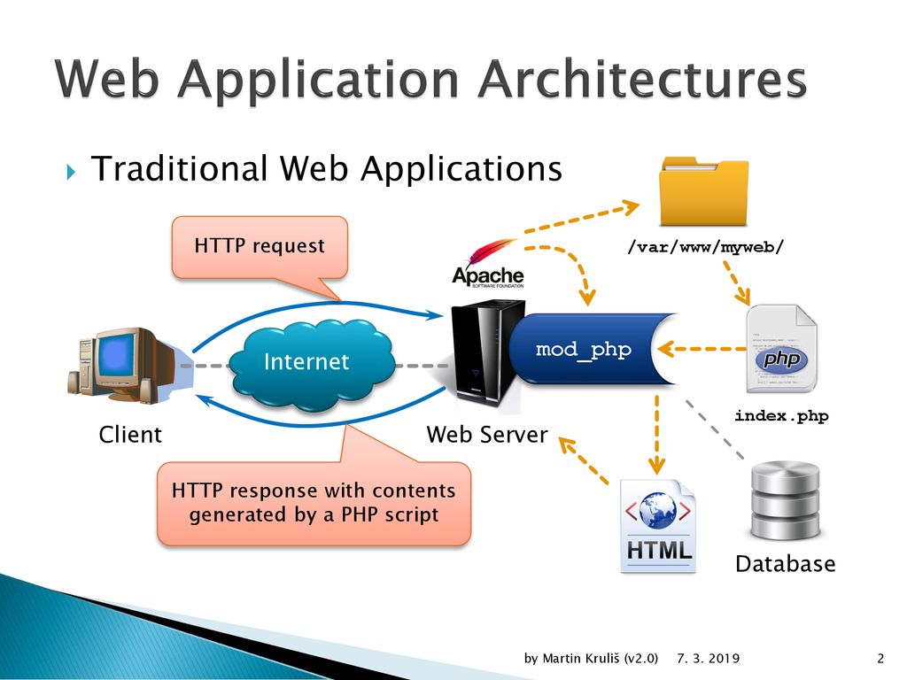

# Introducción

## Recursos

* [Wikipedia](https://es.wikipedia.org/wiki/PHP)
* [w3schools](https://www.w3schools.com/php/)
* [Web oficial](https://www.php.net/)
* [Referencia del lenguaje](https://www.php.net/manual/es/langref.php)
* [Documentación oficial](https://www.php.net/manual/es/index.php)
* [Documentación oficial offline](https://www.php.net/download-docs.php)
* [Zeal (Aplicación para consultar la documentación offline)](https://zealdocs.org/)
*   [XAMPP](https://www.apachefriends.org/es/index.html)

    XAMPP es el entorno más popular de desarrollo con PHP. Es una distribución de Apache completamente gratuita y fácil de instalar que contiene MariaDB, PHP y Perl. El paquete de instalación de XAMPP ha sido diseñado para ser increíblemente fácil de instalar y usar.
* Editores en línea
  * [https://paiza.io/es/projects/new](https://paiza.io/es/projects/new)
  * [https://onlinephp.io/](https://onlinephp.io/)
  * [https://idx.dev/](https://idx.dev/)

## Referencias

* [Uso de PHP a nivel mundial](https://www.tiobe.com/tiobe-index/)
* [Cuota de mercado de PHP](https://kinsta.com/es/cuota-mercado-php/)
* [Encuesta desarrolladores StackOverflow](https://survey.stackoverflow.co/2023/#web-frameworks-and-technologies)

## Contenidos

*   **Instalación**

    Necesitamos instalar el intérprete de PHP para poder ejecutar nuestros scripts en PHP. La forma más sencilla de hacerlo es instalar el paquete XAMPP, que además de incluir el intérprete, también incluye Apache, MySQL y más aplicaciones que necesitaremos a medida que vayamos avanzando.\
    Después de realizar la instalación deberíamos [incluir el fichero "php.exe" en el PATH global de Windows](https://www.php.net/manual/en/faq.installation.php#faq.installation.addtopath).
* [¿Qué es y qué puede hacer PHP?](https://www.php.net/manual/es/introduction.php)

<figure><figcaption></figcaption></figure>
