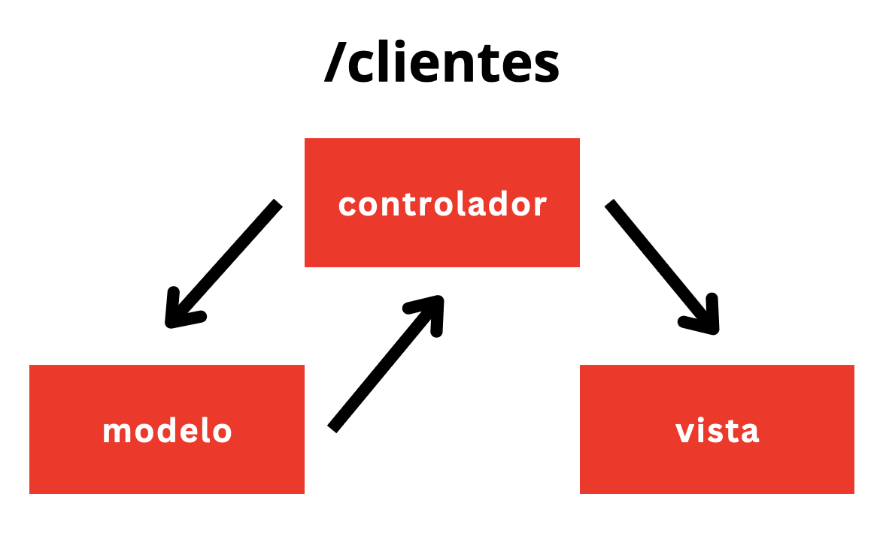
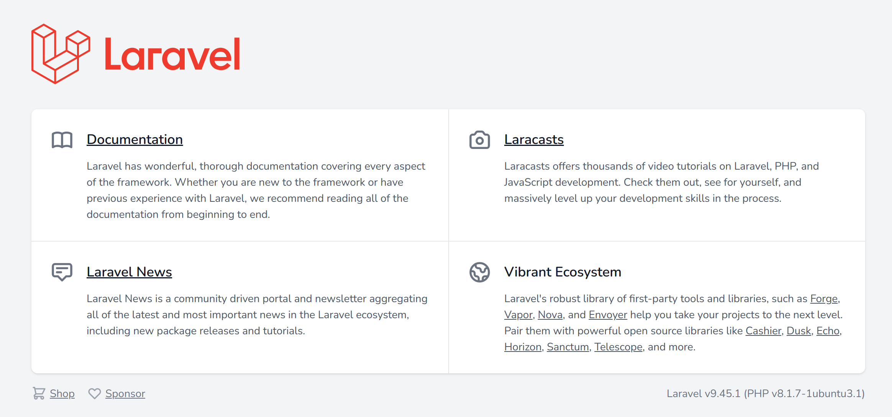

# Introducción

## ¿Qué es Laravel?

Laravel es un framework que nos proporciona un conjunto de herramientas y recursos que nos facilitan la creación aplicaciones web en PHP.

El objetivo de Laravel es conseguir que la implementación de aplicaciones sea un proceso sencillo para el desarrollador, sin por ello sacrificar funcionalidades.

_Happy developers make the best code"_ (https://laravel.com/docs/4.2/introduction)

## MVC

MVC (Modelo-Vista-Controlador) es el patrón de arquitectura de software que sigue Laravel. Permite separar las funcionalidades de cada parte del código. Enfatiza la separación de la lógica de programación respecto a la presentación. Esto hará que el código esté más ordenado y sea más fácil de mantener.

* **Modelo:** encargado de todas las interacciones con la base de datos (obtener, consultar, actualizar, eliminar...). No muestra la información. De ello se encarga la vista. El modelo no actualiza la información directamente; es el controlador quien decide cuándo llamarlo.
* **Vista:** se encarga de todo lo que se ve en pantalla. Laravel tiene un template engine llamado _Blade_ que muestra los datos. El modelo consulta la BD, pero el controlador decide qué vista hay que llamar y qué datos presentar.
* **Controlador:** comunica modelo y vista. Antes de que el modelo consulte la BD, el controlador es el encargado de llamar a un modelo específico. Una vez consultado el modelo, el controlador recibe la información, llama a la vista y le pasa la información.

Un concepto muy importante en Laravel es el de **Router**. El router (/routes/web.php) es el encargado de registrar todas las URL o endpoints que va a soportar nuestra aplicación. Asociado a cada ruta existe un controlador que sabe qué modelo debe llamarse y qué vista mostrar cuando el usuario visita dicha ruta o endpoint.



## Instalación del entorno de trabajo

### Windows

* Instalar Composer ([https://getcomposer.org/doc/00-intro.md#using-the-installer](https://getcomposer.org/doc/00-intro.md#using-the-installer))
  * Comprobar la instalación mediante la ejecución de `composer --version`
*   Crear un nuevo proyecto Laravel:

    ```
    composer create-project laravel/laravel <nombredelaaplicacion>
    ```
* Acceder a ella a través de http://127.0.0.1/\<nombredelaaplicacion>




## Artisan

_Artisan_ es el nombre del CLI que incluye Laravel. Permite crear migraciones, controladores, modelos, policies y mucho más.

Se puede invocar, desde el directorio de la aplicación, mediante el comando `php artisan...`

## Estructura de carpetas de Laravel

De momento, destacamos los siguientes directorios/ficheros de la estructura de un proyecto Laravel:

* **./app/Http/Controllers**: aquí alojaremos nuestros controladores.
* **./app/Models**: en esta carpeta estarán nuestros modelos.
* **./database/migration**: definiremos las migraciones (definiciones del esquema de la base de datos) en esta carpeta
* **./public**: contendrá imágenes, hojas de estilo y código Javascript. La parte pública que ve el usuario. También se aloja en esta carpeta el fichero _index.php_, que es el punto de entrada a la aplicación.
* **./resources/views**: carpeta donde se alojan las vistas.
* **./routes**: carpeta donde están las rutas. Entre otros ficheros, destacamos _web.php_ que es el que define las rutas de la interfaz web.
* **./storage**: donde se suben los ficheros generados por el usuario.
* **./vendor**: donde se colocan las dependencias de composer.
* **./env**: contiene parámetros de configuración que pueden variar en función de dónde se esté ejecutando la aplicación (nombre de la base de datos, usuario y contraseña, etc.).

## Blade

Es el motor de plantillas de Laravel. Las plantillas Blade utilizan la extensión ".blade.php" y se almacenan en "resources/views". En los ficheros blade tendremos una mezcla de código HTML junto con elementos y directivas Blade.

Puedes encontrar la documentación oficial de Blade en el [siguiente enlace](https://laravel.com/docs/10.x/blade).

### Directivas Blade

Las [_directivas Blade_](https://laravel.com/docs/10.x/blade#blade-directives) se podrían considerar una especie de atajos a estructuras de control comunes en PHP, como sentencias condicionales o bucles. Por ejemplo:

```
@if ($records > 0)
    I have records!
@else
    I don't have any records!
@endif
```

en lugar de:

```
<?php if($records > 0) { ?>  
    I have records!  
<?php } else { ?>  
    I don't have any records!  
<?php } ?>
```

Mediante el uso de un motor de plantillas **evitamos utilizar sintaxis PHP o etiquetas PHP en nuestros ficheros de vistas**. En su lugar deberíamos usar **directivas** o **helpers**. La ventaja es que los motores de plantillas limitan el número de funcionalidades disponibles en las vistas y de esta forma se aseguran de que no hacemos _locuras_ en las vistas. Es recomendable que si no encontramos una directiva o helper para una funcionalidad que necesitemos implementar en una vista es, posiblemente, porque dicha funcionalidad no debería estar implementada en la vista. Quizás debería estarlo en un controlador o en otro fichero.

#### Directiva _extends_

Se utiliza en las vistas para cargar otras vistas. Por ejemplo, para cargar una plantilla que contenga el menú principal que se podría incluir en el encabezado de todas nuestras páginas.

```
@extends('layout.app')
```

Esa línea cargaría el contenido de './views/layout/app.blade.php'. Destaca el hecho de que en esta directiva las carpetas se separan de los ficheros utilizando el carácter "." en lugar de "/". Además, parte de la ruta es implícita como se puede apreciar, y el sufijo del fichero se presupone que es ".blade.php".

#### Directiva _yield_

Sirve para declarar una especie de marcador/contenedor en una vista para posteriormente inyectarle contenido desde las vistas padre. Para esto último se utiliza la directiva @section. Requiere dos parámetros. El primero es el identificador del marcador y el segundo (opcional) es un valor por defecto que se inyectará en caso de que la vista no incluya código para dicho marcador.

En la vista hija incluiríamos:

```
<h1>@yield('titulo')</h1>
```

Y en la vista principal incluiríamos:

```
@section('titulo')
    Página principal
@endsection
```

#### Directiva _route_

Devuelve la ruta a la que hace referencia el primer parámetro. Previamente debe estar definido el nombre de la ruta.

```
<a href="{{ route('product.show' }}">...</a>
```

Si la ruta tiene un parámetro, la forma correcta de pasárselo es la siguiente:

```
<a href="{{ route('product.show', ['id'=> $product["id"]]) }}">
```

#### Directivas de autenticación

Permiten mostrar código en las vistas en función de si el usuario está o no autenticado.

```
@auth
    // The user is authenticated...
@endauth

@guest
    // The user is not authenticated...
@endguest
```

### Helpers

Los helpers son funciones que se pueden usar dentro de los scripts de Laravel. Para invocar a helpers hay que incluirlos entre \{{ y \}}.

Por ejemplo,

```
{{ now() }}
```

[Este helper](https://laravel.com/docs/10.x/helpers#method-now) muestra la fecha y hora actuales.

Otro ejemplo lo tenemos en el helper [_asset_](https://laravel.com/docs/9.x/helpers#method-asset), que genera una URL usando el esquema actual de la petición (HTTP o HTTPS).

Puedes encontrar más información sobre helpers en [https://laravel.com/docs/10.x/helpers](https://laravel.com/docs/10.x/helpers)

## Routing en Laravel

Laravel routing es un mecanismo usado para enrutar todas las peticiones que llegan a nuestrea aplicación a métodos o funciones específicas que las tratarán convenientemente. Las rutas de Laravel aceptan una URI y un _closure_. Los _closure_ son una versión de PHP de lo que sería una función anónima. Un _closure_ es una función que puedes pasar como un objeto, asignar a una variable, o pasar como un parámetro a otra función o método.

Las rutas Laravel se definen en los _route files_ localizados en la carpeta _routes_.

* El fichero _routes/web.php_ define rutas a la interfaz web de la aplicación.
* El fichero _routes/api.php_ define rutas a tu API (si dispones de una). Se utilizan en arquitecturas orientadas a servicio o REST APIs.

El contenido por defecto de _routes/web.php_ es el siguiente:

```
Route::get('/', function () {
    return view('welcome');
});
```

Lo cual indica que cuando se acceda a la URL raíz de nuestra aplicación, se mostrará la vista _resources/views/welcome.blade.php_. \
\
[_view()_](https://laravel.com/docs/9.x/helpers#method-view) es un helper que devuelve una instancia de una vista.

A continuación se muestran otras formas de definir rutas en Laravel:

```
Route::get('/', function () {
    $viewData = [];
    $viewData["title"] = "Página principal - Tienda online";
    return view('home.index')->with("viewData", $viewData);
});

Route::get('/contacto', function () {
    $dato1 = "texto1";
    $dato2 = "texto2";
    return view('home.contacto')
        ->with("dato1", $dato1)
        ->with("dato2", $dato2);
});

Route::get('/about', 'App\Http\Controllers\HomeController@about')->name("home.about");
```

* La primera conecta la URI "/" con una _closure_ que devuelve una vista (home.index). Además, se le pasa la variable _viewData_ a la vista _home.index_ mediante el encadenamiento del método _with_ en el helper método _view_ (Revisar traducción).
* La última ruta conecta la URL "/about" con el método _about_ de la clase _HomeController_, alojado en la carpeta /App/Http/Controllers". Además, definimos un nombre personalizado de ruta mediante el encadenamiento del método _name_ en la definición de la ruta. ¿Qué utilidad crees que tiene darle un nombre personalizado a la ruta?

Las rutas también pueden incluir parámetros:

```
Route::get('/cliente/{id}', 'App\Http\Controllers\CustomerController@show');
```

Esta ruta será la encargada de gestionar peticiones del tipo "/cliente/1", por ejemplo. En este caso, al método "ver" de "CustomerController" se le enviará por parámetro el campo "$id". Su declaración deberá realizarse de la siguiente forma:

```
...
public function show($id) {
...
```

A través del comando `php artisan route:list` puedo consultar todas las rutas creadas en nuestra aplicación.

### Rutas POST

Las rutas que utilizan el método POST nos permiten recibir y almacenar información enviada a través de un formulario. Su formato sería el siguiente:

```
Route::post('/test/store', 'App\Http\Controllers\TestController@store')->name("test.store");
```

En este caso, el método "store" deberá definirse con un parámetro: `function store (Request $request)`. Dicho parámetro es un objeto que nos permitirá interactuar con la petición HTTP realizada por nuestra aplicación para acceder a las cookies, campos, ficheros, etc.

En el método "store" podremos establecer las reglas de validación de los campos recibidos. Podemos consultar información sobre las reglas de validación disponibles en [https://laravel.com/docs/9.x/validation#available-validation-rules](https://laravel.com/docs/9.x/validation#available-validation-rules). A continuación mostramos un ejemplo de validación:

```
$request->validate([  "name" => "required|max:255" ]);
```

Si la validación es exitosa el código se ejecutará correctamente. En caso contrario se generarán errores que se podrán consultar a través del objeto global "$errors". Si invocamos a `$errors->all()` podremos mostrar al usuario dichos errores.

Para crear nuevos registros a través del modelo deberemos crear un objeto de la clase del modelo correspondiente y asignarle valor a sus atributos. El valor que le debemos asignar lo obtenemos del objeto $request pasado por parámetro. Finalmente tendremos que invocar al método "save()" de dicho objeto para guardar los datos. Mostramos un ejemplo a continuación:

```
$newCar= new Car();  
$newCar->setBrand($request->input('brand'));  
$newCar->save();
```

Más información sobre el método _input_ en [https://laravel.com/docs/9.x/requests#retrieving-input](https://laravel.com/docs/9.x/requests#retrieving-input)

### Rutas DELETE

Las rutas que usan el método DELETE de HTTP las utilizaremos para eliminar elementos de nuestro modelo. A continuación mostramos un ejemplo:

```
Route::delete('/admin/products/{id}/delete', 'App\Http\Controllers\Admin\AdminProductController@delete')->name("admin.product.delete");
```

En este caso, la ruta tiene un parámetro ($id) que se corresponde con el identificador del registro que vamos a eliminar. Para que le llegue este parámetro a la ruta, el atributo "action" del formulario que enviará los datos debería incluir dicho parámetro. La sintaxis correcta sería la siguiente:

```
<form action="\{\{ route('admin.product.delete', $product->getId())\}\}" method="POST">
    @method('DELETE')
    <button>
        Eliminar
    </button>
</form>
```

Hay que prestar atención al uso de la directiva [`@method`](https://laravel.com/docs/9.x/blade#method-field). Es necesario incluirla para indicar que la ruta utiliza el método DELETE.

### Rutas PUT

Las rutas PUT las utilizaremos para realizar modificaciones en nuestro modelo. A continuación incluimos un ejemplo de una ruta de este tipo.

```
Route::put('/admin/products/{id}/update', 'App\Http\Controllers\Admin\AdminProductController@update')->name("admin.product.update");
```

En este caso el método "update" será el encargado de realizar la modificación correspondiente en el modelo.

Al igual que en el caso anterior, el formulario debe incluir la directiva [`@method`](https://laravel.com/docs/9.x/blade#method-field) para indicar que se va a utilizar el método PUT.

```
<form action="\{\{ route('admin.product.update', ['id'=> $viewData['product']->getId()]) \}\}" method="POST">
    @method('PUT')
    ...
</form>
```

## Controladores

Podemos crear un controlador con:

```
php artisan make:controller <nombredelcontrolador>
```

Esto creará un controlador en la carpeta "/Http/Controllers". Dicho controlador consistirá en una clase con una serie de métodos que tendremos que definir nosotros. Dichos métodos se invocarán desde el router. En dichos métodos se cargarán las vistas y se invocarán a los modelos correspondientes. A continuación se muestra un ejemplo de un route:

```
Route::get('/crear-cuenta', [RegisterController::class, 'index']);
```

y de su asociado:

```
class RegisterController extends Controller
{
    public function index() {
        return view('auth.register');
    }
}
```

Los controladores nos ayudan a tener el código mejor organizado y separar la funcionalidad de las aplicaciones.

## Bases de datos en Laravel

Laravel soporta 4 sistemas gestores de base de datos: MySQL, PostgreSQL, SQLite y SQL Server.

### Migraciones

Las migraciones de Laravel nos proporcionan una especie de "control de versiones" para nuestra base de datos. A través de ellas podremos crear y modificar las diferentes tablas que la conforman.

Para crear una migración en Laravel tenemos que ejecutar:

```
php artisan make:migration create_products_table
```

El comando anterior creará una migración de la tabla de horarios en la carpeta "database/migrations". Cada migración tiene asociada un timestamp que permite determinar su orden.

El fichero generado contendrá una clase con dos métodos: "up" y "down". El método "up" se usará para añadir nuevas tablas, columnas o índices a nuestra base de datos. El comando "down" hace lo contrario.

El método "up" que se genera tiene, por defecto, el siguiente código:

```
Schema::create('products', function (Blueprint $table) {
    $table->id();
    $table->timestamps();
});
```

Nosotros deberíamos editar dicho método, mantener los campos actuales y añadir las columnas correctas junto a su tipo siguiendo el formato:

```
$table-><tipo>("<nombredelcampo>");
```

Por ejemplo:

```
$table->string("username");
```

El método "timestamps" creará las columnas "created\_at" y "updated\_at".

Podemos conocer todos los tipos de campos en [https://laravel.com/docs/9.x/migrations#available-column-types](https://laravel.com/docs/9.x/migrations#available-column-types)

### Configuración de la BD a través del fichero .env

Para ejecutar las migraciones tenemos que modificar el fichero .env alojado en la carpeta principal del proyecto. En él debemos especificar el nombre de la BD, el usuario y la contraseña.

Para ejecutar las migraciones debemos lanzar el siguiente comando:

```
php artisan migrate
```

## Modelos

En Laravel la interacción con la base de datos se lleva a cabo a través de un _object-relational mapper_ denominado **Eloquent**. Cuando usamos Eloquent, cada tabla de nuestra base de datos tiene un modelo correspondiente que se utiliza para interactuar con la tabla. Eloquent nos permitirá también insertar, actualizar y borrar registros.

Los modelos en Laravel están alojados en "app/Http/Models".

Para crear un modelo tenemos que ejecutar:

```
php artisan make:model Product
```

Consideraciones importantes respecto al modelo:

* Eloquent asume que cada modelo está asociado a una tabla que tiene una clave primaria denominada "id". Por lo tanto, en todas nuestras migraciones usaremos el método "id" que crea dicho campo.
* Eloquent asume que el modelo "Cliente" guarda sus registros en una table denominada "Clientes". Esto se aplica a todos los modelos. Más información sobre los nombres de las tablas en [el siguiente enlace](https://laravel.com/docs/8.x/eloquent#table-names).
* Por defecto, Eloquent espera que estén creados los campos "created\_at" y "updated\_at". Por lo tanto, en todas nuestras migraciones utilizaremos el método "timestamps()" visto anteriormente.

Eloquent proporciona a nuestros modelos los siguientes métodos:

* Product::all(): devuelve todos los productos.
* Product::find(1): devuelve el producto con id=1.
* Product::findOrFail(1): igual que el anterior pero devuelve una excepción si no encuentra el registro.
* Product::create(\['name' => 'TV', ...]): crea un nuevo registro en la base de datos.
* Product::destroy(1): elimina el registro con id=1.

El siguiente ejemplo muestra cómo podemos acceder al restultado de uno de los métodos antriores:

```
$product = Product::findOrFail(1);  
echo $product->name; # prints the product’s name  
echo $product["name"]; # prints the product’s name
```

Eloquent almacena los atributos del modelo en un atributo de la clase (un array) denominado `$attributes`.

Para utilizar un modelo determinado en nuestros controladores deberemos insertar la siguiente línea de código al comienzo del fichero correspondiente:

```
use App\Models\Product;
```

## La clase _Storage_

Laravel proporciona una capa de abstracción del sistema de ficheros que permite trabajar de forma muy sencilla con sistemas de ficheros locales, SFTP y Amazon S3.

Esto lo consigue mediante el uso de una clase denominada [Storage](https://laravel.com/api/9.x/Illuminate/Support/Facades/Storage.html). Esta clase contiene una serie de métodos que permiten la creación, borrado y movimiento de ficheros y directorios. También permite la definición del tipo de almacenamiento que vamos a utilizar (por ejemplo, el sistema de ficheros local).

Para utilizar esta clase en nuestro fichero de código, deberemos incluir esta línea al comienzo del mismo:

```
use Illuminate\Support\Facades\Storage;
```

En nuestro caso, vamos a utilizar el "disco público" ([public disk](https://laravel.com/docs/9.x/filesystem#the-public-disk)). Este repositorio utiliza la carpeta "/storage/app/public" y se utiliza para almacenar ficheros que serán accesibles desde la web.

Si queremos almacenar en ese repositorio un fichero que hemos recibido a través de un formulario, lo podemos hacer mediante el método _put_:

```
Storage::disk('public')->put(  
    $imageName,  
    file_get_contents($request->file('nombredelcampo')->getRealPath())  
);
```

*   "public" hace referencia al repositorio indicado anteriormente.

    Para que la carpeta "/storage/app/public" sea accesible a través de la web, tenemos que ejecutar desde la línea de comandos `php artisan storage:link`. Este comando crea un enlace simbólico desde "public/storage" hacia "storage/app/public". A partir de ese momento podremos referenciar a los ficheros alojados en esa carpeta mediante `asset('storage/file.txt')`, por ejemplo.

    Esto es necesario porque cuando ejecutamos nuestra aplicación, los usuarios solo pueden acceder a los ficheros alojados en la carpeta "public/". El resto de carpetas no son accesibles.
* '$imageName' contiene una string con el nombre que se le dará al fichero al almacenarlo en el repositorio.
* [$request->file('nombredelcampo')](https://laravel.com/docs/9.x/requests#files): obtiene una instancia del fichero subido en un formulario.
* [$request->file('nombredelcampo')->getRealPath())](https://www.php.net/manual/en/splfileinfo.getrealpath.php): devuelve la ruta del fichero.

Relacionado con la clase _Storage_ y con la subida de ficheros a través de formularios también tenemos el siguiente método:

* [$request->file('nombredelcampo')->extension()](https://laravel.com/docs/9.x/requests#file-paths-extensions): devuelve la extensión del fichero enviado a través del formulario.
* [$request->hasFile('nombredelcampo')](https://laravel.com/docs/9.x/requests#retrieving-uploaded-files): Comprueba si nos ha llegado a través del envío de un formulario un fichero en un campo determinado.

**NOTA:** Recuerda que cuando enviamos un fichero a través de un formulario, debemos incluir el atributo [`enctype=multipart/form-data`](https://www.php.net/manual/es/features.file-upload.post-method.php) en la declaración de dicho formulario.

## Validación

Laravel dispone de varios [sistemas de autenticación](https://laravel.com/docs/9.x/starter-kits). Nosotros utilizaremos _laravel/ui_, ya que es el único que no requiere frameworks CSS o Javascript adicionales (Tailwind CSS, React, Vue, etc.).

La instalación de _laravel/ui_ se realiza a través del siguiente comando:

```
composer require laravel/ui
```

También necesitamos generar la estructura de ficheros de Bootstrap necesarios para implementar las pantallas de inicio de sesión. Para ello tendremos que ejecutar el comando que se muestra a continuación, **teniendo en cuenta** que debemos responder que "no" cuando nos pregunte si queremos sobreescribir los ficheros "app.blade.php" y "HomeController.php".

```
php artisan ui bootstrap --auth
```

La ejecución del comando anterior generará los siguientes cambios:

* Se creará la carpeta "app/Http/Controllers/Auth".
* Se creará la carpeta "resources/views/auth".
* Se modificará el fichero "routes/web.php".

Posteriormente tendremos que modificar lo siguiente:

* Eliminar la siguiente línea del fichero "web.php", ya que nuestra aplicación no tiene la ruta "/home": ~~Route::get('/home', \[App/Http/Controllers/HomeController::class, 'index'])->name('home');~~
* Cambiar la constante "HOME" del fichero "app/Providers/RouteServiceProvider.php" para que apunte a nuestra ruta principal. Este valor lo utiliza Laravel para redirigir al usuario después de validarse.
* Añadir la línea `Auth::routes();` al final del fichero web.php

### Laravel Middleware

Laravel Middleware nos permite establecer restricciones en nuestra aplicación para controlar el acceso a determinadas páginas. Por ejemplo, impidiendo acceder a un usuario básico acceder al panel de control de nuestra aplicación y redirigiéndolo a la página principal.

Para crear un nuevo middleware, tenemos que ejecutar lo siguiente:

```
php artisan make:middleware AdminAuthMiddleware
```

El nuevo middleware se creará en "app/Http/Middleware/AdminAuthMiddleware.php" y mediante su método "handle" podremos establecer las restricciones que queramos. Por ejemplo:

```
use Illuminate\Support\Facades\Auth;
...
if (Auth::user() && Auth::user()->getRole() == 'editor') {  
    return $next($request);  
} else {  
    return redirect()->route('error.user');  
}
```

De esta forma, se permite al usuario acceder a la ruta solo si su rol es "editor" y en caso contrario se la redirije a una página de error.

En nuestro fichero "web.php" debemos incluir el siguiente código para controlar el acceso a las rutas que deseemos. La forma de hacerlo es la siguiente:

```
Route::middleware('publicador')->group(function () {
    Route::get('/publicar', 'App\Http\Controllers\Admin\AdminPubController@index')->name("admin.pub.index");
    ...
});
```

Además, también tendremos que registrar el middleware en "app/Http/Kernel.php", añadiendo la línea `'admin' => \App\Http\Middleware\AdminAuthMiddleware::class,` al array $routeMiddleware.

## Extensiones para Visual Studio Code

Se recomienda instalar "Laravel Blade Snippets", "Laravel Snippets", "Laravel goto view" y "Laravel Extra Intellisense". Para PHP, "PHP Intellisense", "PHP Intelephense" y "PHP Namespace Resolver"

## Varios

* `\{\{ \}\}`: Lo podemos encontrar en ficheros Blade. Procesa lo que está en el interior como código PHP, para mostrar el resultado. Es como hacer un echo. Por ejemplo, `{{1+1}}` mostraría 2. También se utilizan para invocar helpers. Y para mostrar información pasada a la vista.
