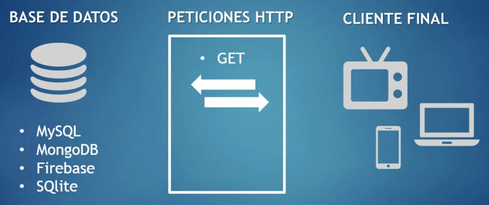
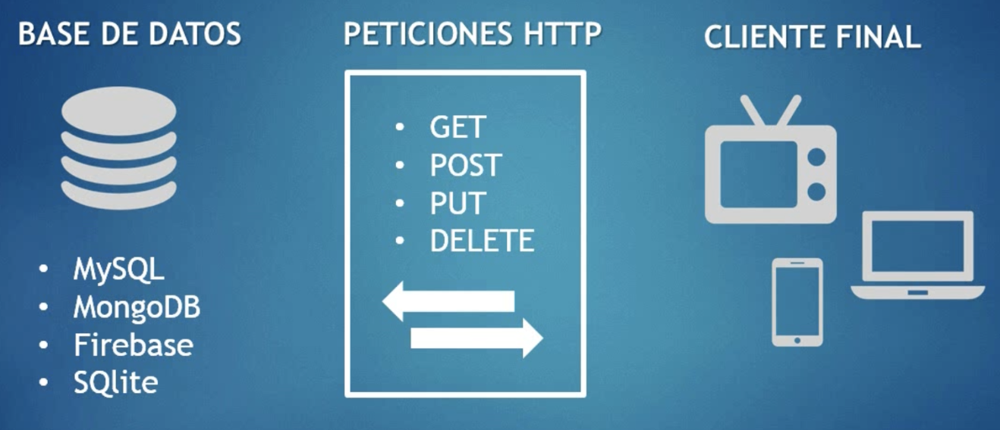

# APIRest con Laravel

## ¿Qué es una APIRest?

APIRest es un estándar para la creación de servicios web.

* **API:** Application Programming Interface - Interfaz de programación de aplicaciones.
* **REST:** Representational State Transfere - Transferencia de estado representacional.

APIRest nos proporciona interfaz de aplicaciones para transferir datos.

**APIRestFul** hace referencia a una APIRest que, además de lo anterior, nos permite crear nuevos registros, modificar los existentes o eliminarlos.

## Características

* Desarrolladas por programadores, para programadores.
* Pueden ser públicas o privadas.
* Pueden ser gratuitas o de pago.
* Algunas API están protegidas por token de seguridad.
* Diferentes lenguajes permiten su implementación: PHP y sus diferentes frameworks, NodeJS, etc.
* Es fundamental elaborar documentación que permita conocer su uso al programador que la vaya a utilizar.

## Tipos de autorizaciones

* **OAUTH**: "Open Authorization". Es un estándar abierto que permite flujos simples de autorización para sitios web o aplicaciones informáticas. Es una simple combinación de caracteres que se comvierte en una contraseña. Implica pasar en el encabezado el campo "Authorization" con el valor correspondiente
* **OAUTH 2**: Es un flujo de autorización específico encapsulado en un token portador (bearer token) y se genera con la combinación de unas credenciales que le suministra la empresa al cliente llamadas CLIENT ID y SECRET KEY. En algunas ocasiones usan el encriptado md5() o base64_encode() para combinar las credenciales del cliente y generar el Token. Un ejemplo lo tenemos en Udemy.
* **API KEY**: Es un identificador que sirve como el medio de autenticación de un usuario para el uso de los servicios proporcionados de una API REST. Este valor es único y el cliente debe solicitarlo al proveedor de la API. Un ejemplo lo tenemos en ExchangeRateAPI

La autenticación puede ser:
* Por cabecera (Headers): Se da cuando el token de autorización debe ser pasado de forma oculta por cabeceras HTTP.
* Por URL

## Formato JSON

JSON = JavaScript Object Notation

Estándar basado en texto plano para el intercambio de infomación. Se usa en muchos sistemas que requieren mostrar o enviar información para ser interpretada por otros sistemas.

Mediante una APIRest se envían datos, y con JSON se estandariza el envío de esos datos.

Hasta hace unos años se utilizaba XML, pero en la actualidad se ha extendido el uso de JSON.

JSON está formado por arrays y objetos:
* array: [0,1,2,3,4]
* objeto: {"propiedad":"valor"}

### JSON en PHP

Si invocamos una API desde PHP, recibiremos una cadena de texto. Para poder manejar los datos incluidos en dicha string, tendremos que usar el método [json_decode(json, true)](https://www.php.net/manual/en/function.json-decode.php), al cual se le pasa una string y te devuelve un objeto o un array, dependiendo del segundo parámetro.

## Campo STATUS - Respuestas API

Dentro de una respuesta de una API debe existir un campo "STATUS" con un código que indique el resultado de la operación. Podemos encontrar los códigos HTTP estándar en la siguiente URL: https://developer.mozilla.org/es/docs/Web/HTTP/Status

Los más utilizados son:
* 200 - Consulta correcta.
* 201 - Actualización de datos correcta.
* 404 - Recurso no encontrado.
* 500 - Error interno en el servidor.

## Ejemplos de API públicas

* [Repositorio GitHub con enlaces API públicas](https://github.com/public-apis/public-apis)
* [Disney API](https://disneyapi.dev)
  * [Documentación de la API](https://disneyapi.dev/docs).
  * URL base: https://api.disneyapi.dev
  * Endpoints:
    * /characters
    * /characters/{id}
    * /character?name=Mickey%20Mouse
* [ExchangeRate-API](https://app.exchangerate-api.com)
  * API Key 2dcd420c181a926a8c923203
  * Ejemplo GET: https://v6.exchangerate-api.com/v6/YOUR-API-KEY/pair/EUR/GBP
  * Ejemplos de uso: https://www.exchangerate-api.com/docs/pair-conversion-requests

## APIRest en Laravel

Para implementar una APIRest en Laravel, debvemos tener en cuenta lo siguiente::

* Definir las rutas de la API en /routes/api.php. Por ejemplo:

        Route::get('/player/', 'App\Http\Controllers\PlayerController@index');

    La ruta anterior será accesible desde 'http://localhost:8000/api/player/'

* Controlar los errores para devolver la salida correcta en formato JSON. El mensaje de error se incluye en el campo "message". En este caso, el código del error sería el [500](https://developer.mozilla.org/es/docs/Web/HTTP/Status/500):
  
        try {
            $players = Player::all();
        } catch (Exception $e) {
            return response()->json([
                'data' => [],
                'message'=>$e->getMessage()
            ], JsonResponse::HTTP_INTERNAL_SERVER_ERROR);
        }

* Generar la salida correcta en formato JSON. Los datos se deben pasar en el campo "data". En este caso el código de a respuesta debe ser [200](https://developer.mozilla.org/es/docs/Web/HTTP/Status/200).

        return response()->json([
            'data' => $players,
            'message' => 'Succeed'
        ], JsonResponse::HTTP_OK);

Para que funcione el código anterior es necesario incluir las siguientes sentencias "use" en el controlador:

    use App\Models\Post;
    use Exception;
    use Illuminate\Http\JsonResponse;

## Software recoomendado

* [JSONView](https://chrome.google.com/webstore/detail/jsonview/gmegofmjomhknnokphhckolhcffdaihd?hl=es): extensión de Chrome/Brave para visualizar las respuestas JSON de forma tabulada.
* [Postman](https://www.postman.com/): nos permite crear peticiones APIRestFul y visualizar los resultados. Se puede descargar desde [aquí](https://www.postman.com/downloads/).